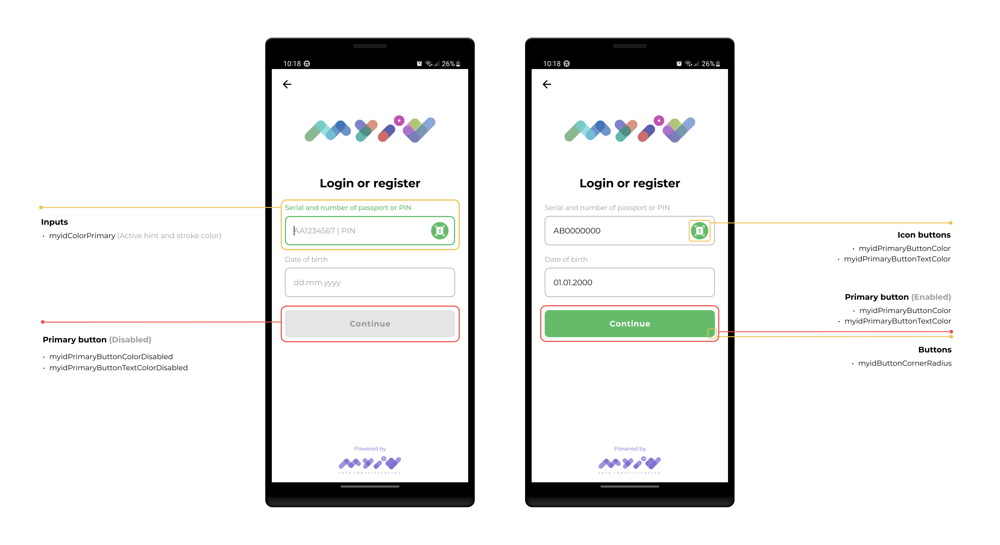
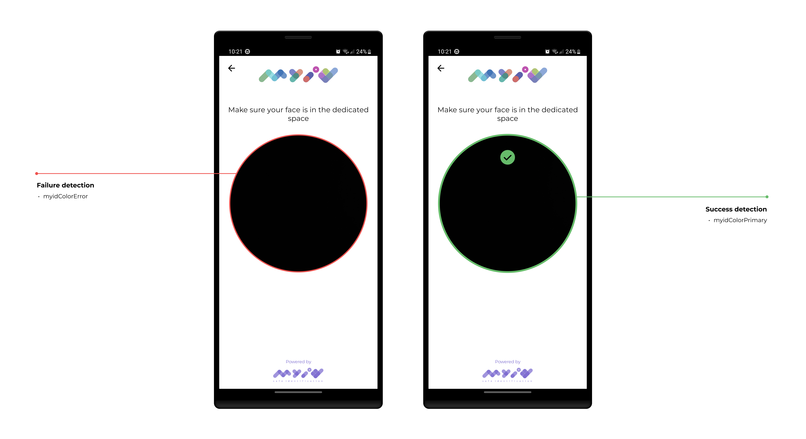

#### The Android SDK supports the customization of colors, buttons and strings used in the SDK flow.

- [Localization](#localization)
- [Custom Organization Details](#custom-organization-details)
- [UI customization](#ui-customization)

## Localization

The MyID Android SDK supports translations for the following languages:

- Uzbek      (uz) 🇺🇿
- UzbekCyrillic (uz) 🇺🇿
- Karakalpak (kk) 🇺🇿
- Tajik      (tg) 🇹🇯
- English    (en) 🇬🇧
- Russian    (ru) 🇷🇺

By default, the Uzbek language is used. However, you can also call the `withLocale(MyIdLocale)`
method of the `MyIdConfig.Builder` configuration to set the language.

## Custom Organization Details

You can customize the SDK, for it to match your organization's brand book, by
providing `MyIdOrganizationDetails` object to `withOrganizationDetails` method. The object allows you to
customize following fields:

- *phoneNumber* - by default 712022202, which is MyID's call center. If you would like the customer
  to call your own call center, you can display your own phone number on the error screen, by
  providing it in this field ([sample](../images/screen01.jpg)).
- *logo* - the drawable asset, that will be displayed on the input screen. If you would like to
  display your own logo on the top of the screen, this is the place to provide it. Make sure it fits
  the imageView element, which has the *240x60* size.

## UI customization

**Colors**

You can define custom colors inside your own `colors.xml` file:

Here’s the documentation with your color definitions explained in the same style:

---

You can define custom colors inside your own `colors.xml` file:

- `myid_color_primary`: Defines the color of SDK which guides the user through the flow
- `myid_color_onPrimary`: Text or icon color displayed on top of `myid_color_primary`
- `myid_color_error`: Used for error messages, borders, or icons
- `myid_color_onError`: Text or icon color used on error backgrounds
- `myid_color_divider`: Used for dividing UI elements with subtle lines
- `myid_color_outline`: Used for borders, strokes, or outlines of components
- `myid_color_success`: Used to indicate successful actions or results
- `myid_color_progress_indicator_active`: Active progress bar or loading spinner color
- `myid_color_progress_indicator_inactive`: Background color of inactive progress indicators
- `myid_button_container_color`: Background color of enabled buttons
- `myid_button_container_disabled_color`: Background color of disabled buttons
- `myid_button_content_color`: Text/icon color on enabled buttons
- `myid_button_content_disabled_color`: Text/icon color on disabled buttons
- `myid_scan_button_tint_color`: Background color of scan icon button

**Widgets**

You can customize the appearance of some widgets in your `dimens.xml` file by overriding:

* `myid_button_corner_radius`: Defines the radius dimension of all the corners of primary buttons

#

