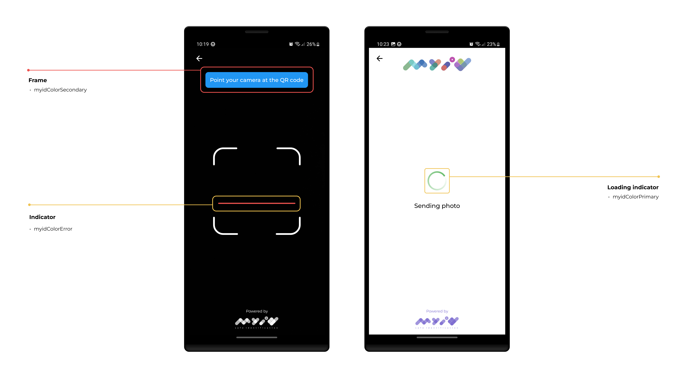
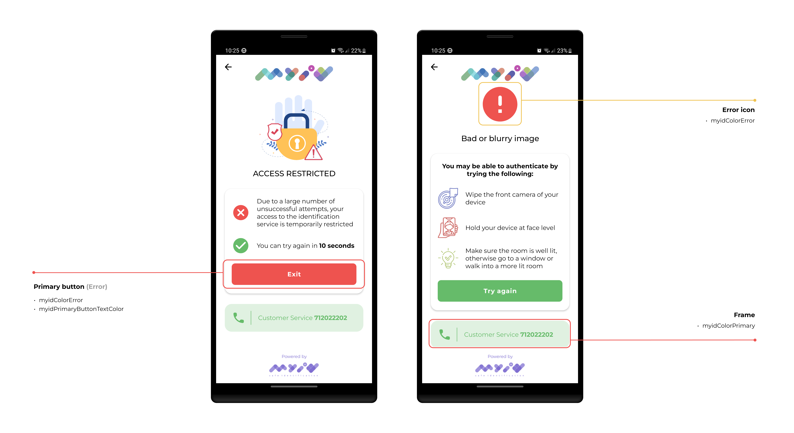

#### The iOS SDK supports the customization of colors, buttons and strings used in the SDK flow.

- [Localization](#localization)
- [Custom Organization Details](#custom-organization-details)
- [UI customization](#ui-customization)

## Localization

The MyID iOS SDK supports translations for the following languages

- Uzbek      (uz) 🇺🇿
- English    (en) 🇬🇧
- Russian    (ru) 🇷🇺

By default, the Uzbek language is used. However, you can also change options `config.locale = MyIdLocale.EN` configuration to set the language.

## Custom Organization Details

You can customize the SDK, for it to match your organization's brand book, by providing `MyIdOrganizationDetails` object to `organizationDetails` option.
The object allows you to customize following fields:

- *phoneNumber* - by default 712022202, which is MyID's call center. If you would like the customer to call your own call center, you can display your own phone number on the error screen, by providing it in this field (sample).

- *logo* - UIImage object, that will be displayed on the input screen. If you would like to display your own logo on the top of the screen, this is the place to provide it.

## UI customization

Here’s the converted version of your `MyIdAppearance` class, following the same structure and style:

```swift
let appearance = MyIdAppearance()
appearance.colorPrimary = <DESIRED_UI_COLOR_HERE>
appearance.colorOnPrimary = <DESIRED_UI_COLOR_HERE>
appearance.colorError = <DESIRED_UI_COLOR_HERE>
appearance.colorOnError = <DESIRED_UI_COLOR_HERE>
appearance.colorOutline = <DESIRED_UI_COLOR_HERE>
appearance.colorDivider = <DESIRED_UI_COLOR_HERE>
appearance.colorSuccess = <DESIRED_UI_COLOR_HERE>
appearance.colorButtonContainer = <DESIRED_UI_COLOR_HERE>
appearance.colorButtonContainerDisabled = <DESIRED_UI_COLOR_HERE>
appearance.colorButtonContent = <DESIRED_UI_COLOR_HERE>
appearance.colorButtonContentDisabled = <DESIRED_UI_COLOR_HERE>
appearance.colorScanButtonContainer = <DESIRED_FLOAT_RADIUS_HERE>
appearance.buttonCornerRadius = <DESIRED_FLOAT_RADIUS_HERE>
```

- `colorPrimary`: Defines the color of SDK which guides the user through the flow  
- `colorOnPrimary`: Defines the color of text and icons shown on top of the primary color  
- `colorError`: Defines the color of error buttons, icons, and states  
- `colorOnError`: Defines the color of text and icons shown on top of error backgrounds  
- `colorOutline`: Defines the color of borders and outlines for inputs and cards  
- `colorDivider`: Defines the color of thin lines separating UI sections  
- `colorSuccess`: Defines the color used to show successful actions or states  
- `colorButtonContainer`: Defines the background color of the primary action buttons  
- `colorButtonContainerDisabled`: Defines the background color of disabled buttons  
- `colorButtonContent`: Defines the color of text/icons in primary action buttons  
- `colorButtonContentDisabled`: Defines the color of text/icons in disabled buttons 
- `colorScanButtonContainer`: Defines the color of scan icon button
- `buttonCornerRadius`: Defines the corner radius of all primary buttons

#





