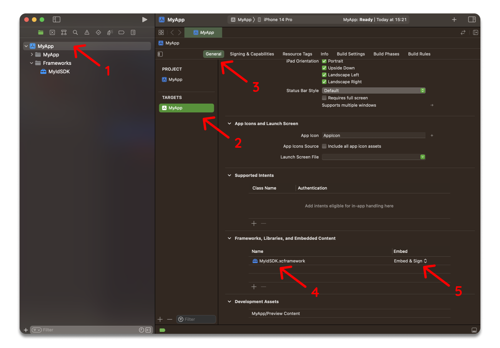

### Manual Installation

1. Select your project in Xcode.

2. Select your app target.

3. Select the **General** tab and then scroll down to **Frameworks, Libraries, and Embedded Content**.

4. Add the following files from the [release assets](https://gitlab.myid.uz/myid-public-code/myid-ios-sdk/-/releases):

    - `MyIdSDK.xcframework`

    > **Note**: Ensure you add the .xcframework files, rather than the .framework files.

5. Under the **Embed** column, ensure **Embed & Sign** is set for MyIdSDK framework.
